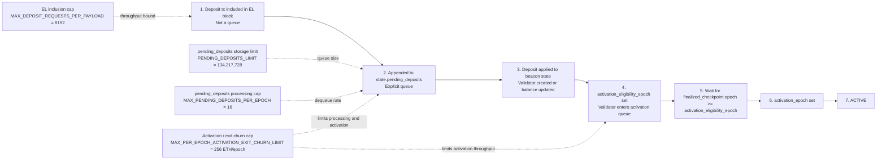

# Ethereum Staking after Pectra: Deposit → Pending Queues → Active Validator

A clean explanation of the **post-Pectra / Electra** onboarding path for a **new validator**.

## Short answer

After a deposit transaction is included in a valid canonical execution block, the validator path is:

```text
EL deposit tx included
→ appended to pending_deposits
→ deposit applied to beacon state
→ activation_eligibility_epoch set
→ waits for finalization + churn
→ activation_epoch set
→ ACTIVE
```

There is **no separate queue before `pending_deposits`**.

There are **2 waiting stages that matter**:

1. **`pending_deposits`** — explicit queue in beacon state  
2. **activation queue** — implicit queue formed by validator state fields and activation rules

---

## Mermaid diagram



---

## Clean state-by-state view

### 1) Deposit tx included in execution layer
Your deposit transaction is included in a valid execution-layer block.

- This is **not** a queue.
- If the block finalizes, the transaction finalizes.
- Once the consensus client processes that block, the deposit request is appended to `state.pending_deposits`.

### 2) `pending_deposits`
This is the **first real queue**.

- State object: `state.pending_deposits`
- It is an **explicit list in beacon state**
- New deposits wait here before being applied to validator state

#### Limits
- `PENDING_DEPOSITS_LIMIT = 134,217,728`
- `MAX_PENDING_DEPOSITS_PER_EPOCH = 16`

A deposit can remain here because:

- earlier pending deposits are ahead of it
- the per-epoch processing cap is exhausted
- the activation/exit churn budget is exhausted
- finalization-related checks are not yet satisfied

### 3) Deposit applied to beacon state
When `process_pending_deposits()` handles the entry:

- if the pubkey is new, a validator record is created
- otherwise, the existing validator balance is updated

At this point:

- the balance can already be visible in consensus state
- the validator is still **not active**
- `activation_eligibility_epoch` may still be `FAR_FUTURE_EPOCH`

This is the subtle part: **deposit applied** does **not** mean **entered activation queue** yet.

### 4) Validator enters activation queue
The validator effectively enters the activation queue when `activation_eligibility_epoch` is set.

This happens in `process_registry_updates()` when the validator satisfies the activation-queue condition, including:

- `activation_eligibility_epoch == FAR_FUTURE_EPOCH`
- `effective_balance >= MIN_ACTIVATION_BALANCE`

#### Minimum balance
- `MIN_ACTIVATION_BALANCE = 32 ETH`

After this step:

- `activation_eligibility_epoch` is set
- the validator is now in the **implicit activation queue**

### 5) Wait for finalization
Being in the activation queue is still not enough.

The validator must wait until:

```text
finalized_checkpoint.epoch >= activation_eligibility_epoch
```

Only then can it be assigned an `activation_epoch`.

### 6) `activation_epoch` is set
Once eligible, the validator is assigned:

```text
activation_epoch = compute_activation_exit_epoch(current_epoch)
```

This schedules activation a few epochs in the future.

#### Related constant
- `MAX_SEED_LOOKAHEAD = 4`

### 7) Active validator
When the chain reaches `activation_epoch`, the validator becomes active and starts receiving duties.

---

## Why balance can show up before `activation_eligibility_epoch`

This is due to **epoch-processing order**.

In Electra epoch processing:

1. `process_registry_updates()` runs first
2. `process_pending_deposits()` runs later

So if your deposit is applied during epoch **N** processing:

- your balance may already appear in state at the end of epoch **N**
- but the activation-queue check for that epoch has already happened
- therefore `activation_eligibility_epoch` is typically not set until the **next** epoch-processing pass

### Practical timing
- 1 epoch = 32 slots
- 1 slot = 12 seconds
- 1 epoch ≈ 6.4 minutes

So after the deposit is applied, it can take **up to about one more epoch** before `activation_eligibility_epoch` gets set.

This delay is **not a third queue**. It is just a consequence of the processing order.

---

## Exact queue model

### Queue 1: `pending_deposits`
Explicit queue.

**Defined by**
- `state.pending_deposits`

**Length**
- actual queue length = number of entries currently in `state.pending_deposits`
- maximum storage capacity = `PENDING_DEPOSITS_LIMIT`

**Rate limit**
- at most `MAX_PENDING_DEPOSITS_PER_EPOCH = 16` processed per epoch
- also constrained by activation/exit churn

---

### Queue 2: activation queue
Implicit queue.

There is **no** `pending_activations` list in state.

This queue is formed by validators that:

- already had their deposit applied
- have enough balance
- have `activation_eligibility_epoch` set
- are still waiting for finalization and activation throughput

**Length**
- actual queue length = number of validators waiting in this state
- there is **no separate fixed array-size constant** for this queue

**Rate limit**
- controlled by activation/exit churn

#### Churn cap
- `MAX_PER_EPOCH_ACTIVATION_EXIT_CHURN_LIMIT = 256 ETH per epoch`

For standard 32 ETH validators, that corresponds to roughly **8 validators worth of balance per epoch** when the cap is binding.

---

## Per-block inclusion cap

This is **not** a queue, but it is a throughput limit:

- `MAX_DEPOSIT_REQUESTS_PER_PAYLOAD = 8192`

Meaning:

- a single execution payload can carry at most 8,192 deposit requests
- if a block is already at that cap, a new deposit transaction would generally wait for another block
- once your tx is included in a valid canonical block, it proceeds into `pending_deposits`

---

## Timeline example

Assume your deposit is processed out of `pending_deposits` during epoch **N**.

### End of epoch N
- deposit is applied
- validator exists in state
- balance is visible
- `activation_eligibility_epoch` may still be `FAR_FUTURE_EPOCH`

### End of epoch N+1
- `process_registry_updates()` runs again
- validator now satisfies activation-queue conditions
- `activation_eligibility_epoch` is set to `N+2`

### Later
- once the chain finalizes through epoch `N+2`, the validator becomes eligible for activation assignment

### Then
- `activation_epoch` is set to `compute_activation_exit_epoch(current_epoch)`

### At `activation_epoch`
- validator becomes **ACTIVE**

---

## Clean wording for docs

Use this wording if you want a compact explanation:

> After Pectra, a new validator deposit goes through two waiting stages on the consensus side: first `pending_deposits`, which is an explicit queue, and then the activation queue, which is implicit. A deposit may be visible in consensus state before `activation_eligibility_epoch` is set, because deposit processing and activation-queue entry happen in different epoch-processing steps.

---

## Constants summary

| Constant | Meaning |
|---|---|
| `MAX_DEPOSIT_REQUESTS_PER_PAYLOAD = 8192` | Per execution payload deposit-request cap |
| `PENDING_DEPOSITS_LIMIT = 134,217,728` | Maximum storage capacity of `pending_deposits` |
| `MAX_PENDING_DEPOSITS_PER_EPOCH = 16` | Maximum pending deposits processed per epoch |
| `MIN_ACTIVATION_BALANCE = 32 ETH` | Minimum effective balance for activation queue entry |
| `MAX_PER_EPOCH_ACTIVATION_EXIT_CHURN_LIMIT = 256 ETH` | Max activation/exit churn per epoch |
| `MAX_SEED_LOOKAHEAD = 4` | Used when computing `activation_epoch` |

---

## Suggested repo structure

```text
.
├── README.md
└── assets/
```

If you want this as a GitHub Pages site, you can use this `README.md` directly, or move the content into `index.md` in a Pages-enabled repo.
